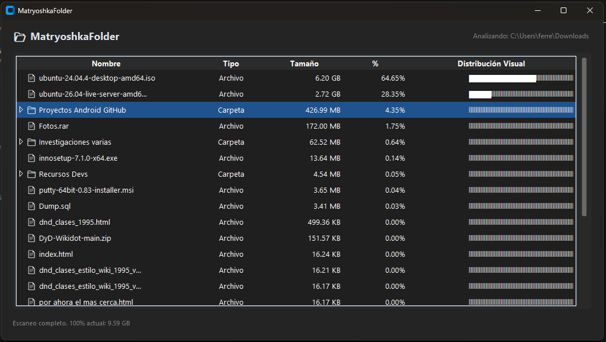
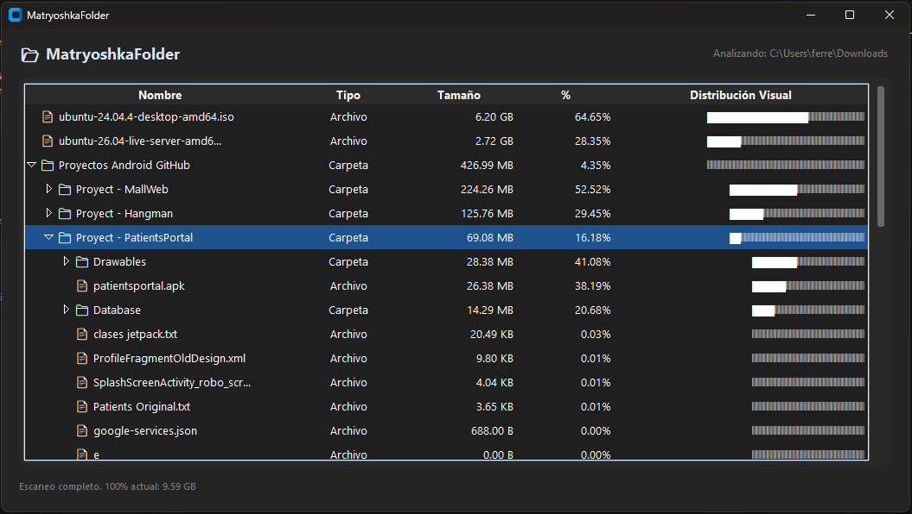
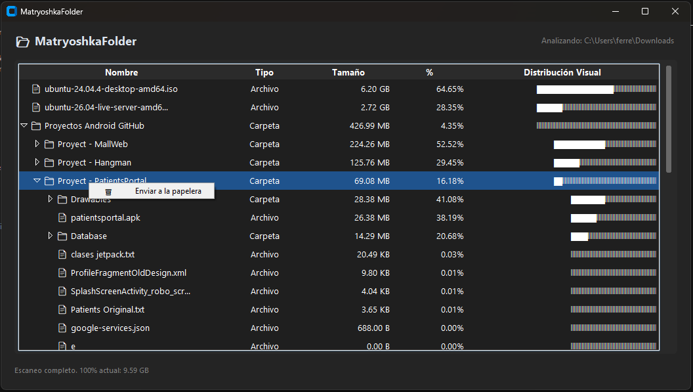

# 📂 MatryoshkaFolder

**MatryoshkaFolder** es una herramienta de escritorio ligera, moderna y veloz desarrollada en Python (utilizando `CustomTkinter`) diseñada para analizar el espacio en disco, visualizar la distribución de archivos de forma clara y gestionar carpetas pesadas al instante. Inspirada en el concepto de las muñecas rusas, te permite adentrarte en las estructuras de directorios de manera interactiva.

---

## 📸 Capturas de Pantalla

| Vista General del Escaneo | Navegación Interna y Despliegue | Menú Contextual (Papelera) |
| :---: | :---: | :---: |
|  |  |  |

---

## ✨ Características Principales

* **📊 Análisis Visual de Espacio:** Calcula el peso total de carpetas y archivos, mostrando porcentajes precisos y una barra de distribución visual para identificar rápidamente qué consume más espacio[cite: 6].
* **📂 Árbol Desplegable Interactivo:** Explora subdirectorios de forma jerárquica directamente en la misma vista o haz **doble clic** en cualquier carpeta para convertirla en la nueva raíz de análisis[cite: 7].
* **🗑️ Gestión Directa y Segura:** Incluye un menú contextual con clic derecho para enviar archivos o carpetas pesadas directamente a la papelera de reciclaje mediante `send2trash`[cite: 8], recalculando el espacio de forma automática al instante.
* **🎨 Interfaz Moderna (Modo Oscuro/Claro):** Diseñado con una interfaz limpia basada en Windows 11 utilizando `CustomTkinter` y `ttk.Treeview`.

---

## 🚀 Descarga e Instalación

### Opción 1: Descargar el Instalador (Recomendado para usuarios)
Podés descargar el instalador ejecutable más reciente directamente desde la sección de **[Releases](../../releases)** con un solo clic y dejarlo instalado en tu equipo.

### Opción 2: Ejecutar desde el Código Fuente (Desarrolladores)
Cloná el repositorio:

## Bash
git clone https://github.com/TU_USUARIO/MatryoshkaFolder.git
cd MatryoshkaFolder

Instalá las dependencias necesarias:

pip install customtkinter send2trash pyinstaller

## Ejecutá la aplicación:

python MatryoshkaFolder.py

## 🛠️ Tecnologías Utilizadas

* **Python** como lenguaje principal.
* **CustomTkinter** y **Tkinter (ttk)** para la interfaz gráfica de usuario.
* **Send2Trash** para la gestión segura de archivos hacia la papelera de reciclaje del sistema operativo.
* **PyInstaller** e **Inno Setup** para la compilación y empaquetado del instalador.

---

## 🤝 Contribuciones

¡Las contribuciones, reportes de bugs y sugerencias son totalmente bienvenidos! Si querés sumar mejoras, podés hacer un fork del repositorio y mandar un pull request.

---

## 📄 Licencia

Este proyecto está bajo la licencia MIT. Consultá el archivo `LICENSE` para más detalles.
